# GLSL Fractals
Time estimate: 60 minutes

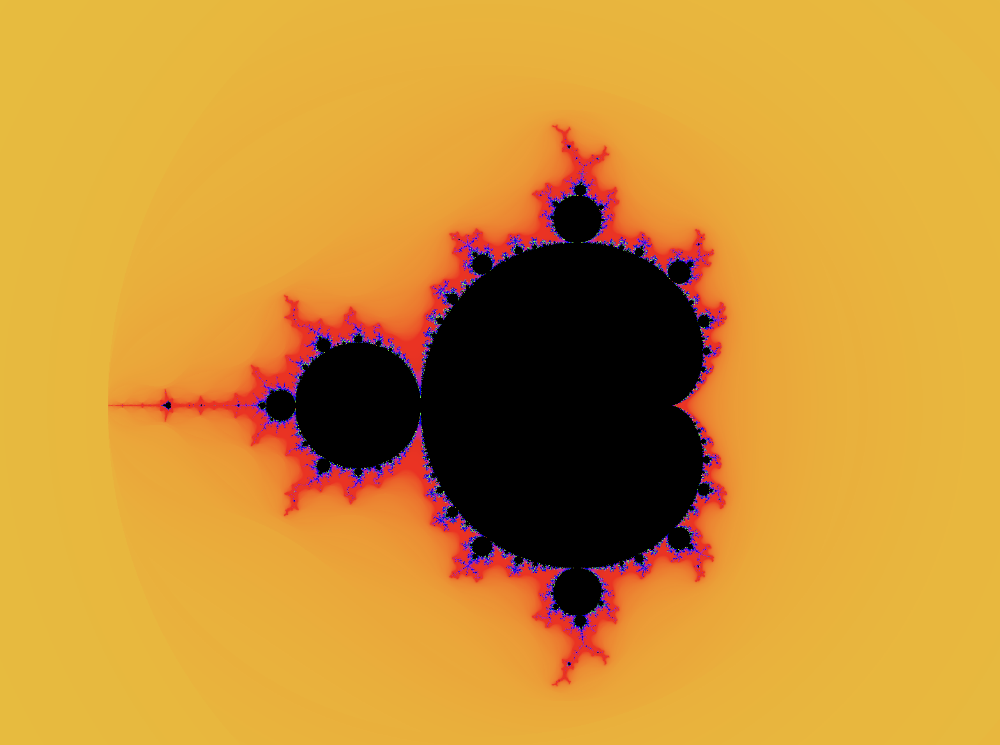{:width="500px"}

You may have seen or heard of fractals. Even if you haven't, you've probably seen an hour long video of someone zooming into a picture, revealing more and more detail the farther they go.


Well this particular geometrical shape shown in the GIF is part of a large family of *infinitely* detailed, *infinitely* precise object, called **fractals**. Today, we are going to write a computer program that will allow us to create the same fractal you see in the images above, namely, the ***Mandelbrot set***


## What is the Mandelbrot set?
The Mandelbrot set is perhaps the most famous fractals ever discovered. We'll start coding soon, but first, we need to learn about the Mandelbrot set and how its derived.

You've probably heard of complex and imaginary numbers before, if not then here's a quick rundown. The *imaginary* number `i` is defined as being the square root of `-1`. You might think about this for a second, and then come to the conclusion of, wait, thats impossible! No number multiplied by itself equals -1, and thats true! No *real* number exists who's square is `-1`. Because of this limitation of real numbers, mathematicians created the imaginary number `i` which is defined as `i = √-1`.

Complex numbers are just any number that has a **real** and **imaginary** component.

`a  +  bi`

In that number, `a` represents the real part, and `bi` is the imaginary component. A good way to think of complex numbers is like mixed numbers, like "one and three fourths". Mixed numbers have a *whole* component and a *fractional* component, just as complex numbers have a *real* and *imaginary* component.

So how does this have anything to do with the Mandelbrot set, or fractals in general? Well there's something really cool we can do with these complex numbers.

### The Complex Plane
The complex plane is a way to map any complex number to a point on a graph. To understand how it works, first look at this is an ordinary plane, with an ordinary point (point A) located at (4,6)

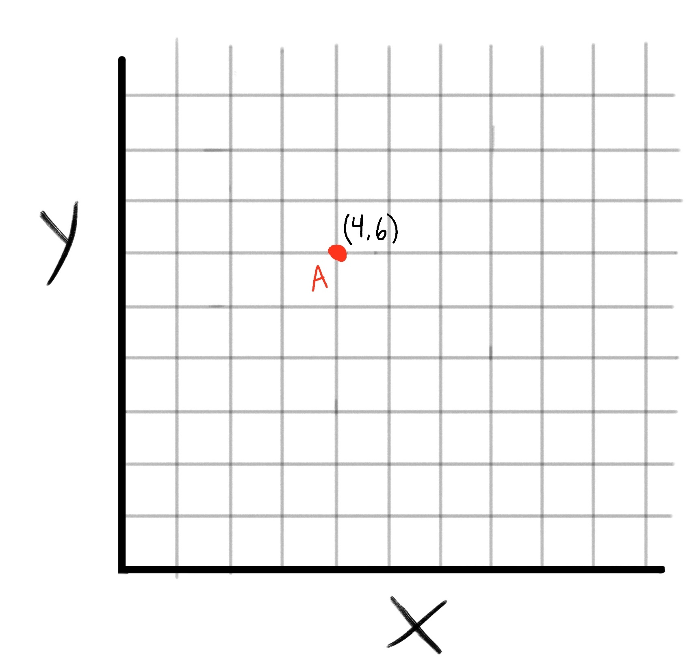{:width="400px"}

The Complex Plane might sound complex but its just a way of translating any complex number into a point on a graph, and vice versa.

You'll recall that complex numbers have to form `a + bi`. To get the corresponding point on the plane, just take `a` as the x value and `b` as the y value.

For example, if we have the complex number `4 + 6i`, it's corresponding point on the complex plane would be `(4,6)`. Simple, right?

Again let me emphasize the form of complex numbers. **In `a + bi`, A is the *real* part of the complex number, and B is the *imaginary* part of the complex number**

Another way to visualize the complex plane is to rename the axes from the image above.

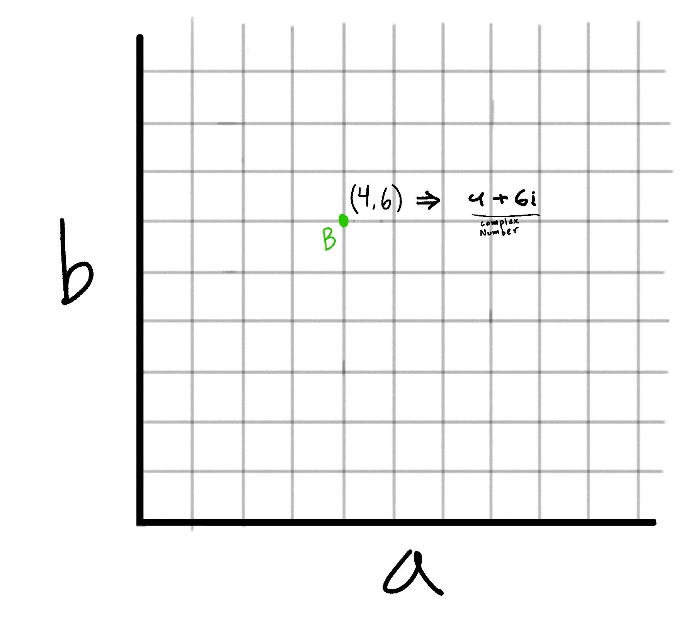{:width="500px"}

Now you can see how the point `(4,6)` on the plane translates to the complex number `4 + 6i`

So now we have this method of converting any complex number to a point on the complex plane. So what can we do with that?

Well this is where the actual formula for the Mandelbrot set comes in.

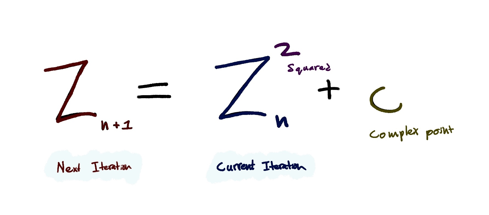{:width="500px"}

This might look pretty scary at first, but I promise it will make sense soon. First of all, what even is this? Essentially, this equation is a formula that we *recursively* apply to a complex number(like `2 + 3i`  or  `5 + 2i`). 

Let me walk you through the steps of the equation. This equation essentially just tell you how to calculate the next number in a sequence, so we kind of need a sequence to start with. Lets initialize one that just starts with the value of zero

`Our sequence => 0`

Now this formula needs an input. That input is a complex number. As you can recall we can take any point on the plane and use it as a complex number. So lets choose the point `(1,2)`, which corresponds to the complex number `1 + 2i`. Let's call this point `C`

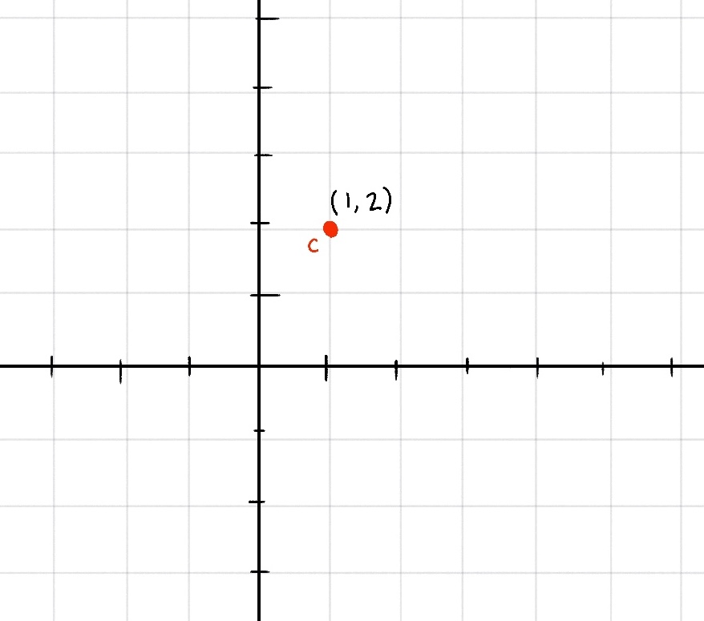{:width="300px"}

Now to find the next number in the sequence, the formula states we
1. Take the **previous** number in the sequence and **Square it**
2. Add a complex number **C** to the result

So lets do that;

Currently our sequence is just `[0]` so in this case, `0` is the previous number in the sequence, and for the complex number, ours is `1 + 2i`. So our equation for the next number in the sequence is

{:width="300px"}

The zero can be discarded and we are left with `(1 + 2i)`

`Our sequence => 0, 1 + 2i`

Now lets repeat that. Now to find the third number in the sequence, we take the square of the previous number(which is what we just found), and add our complex number C to it.

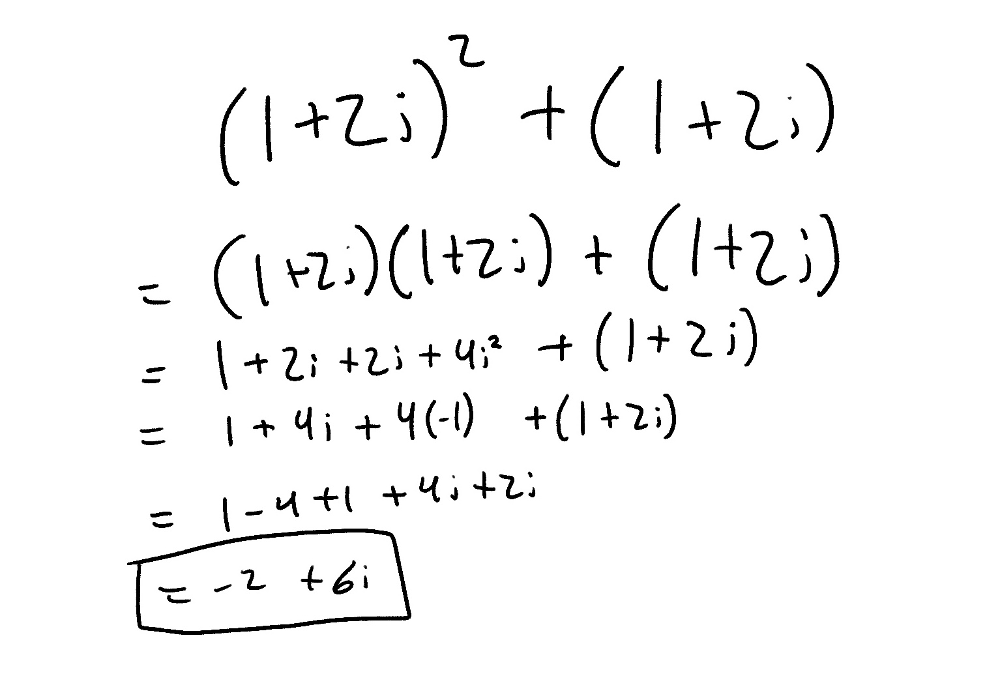{:width="500px"}

Wow! That's a lot longer than then the previous iteration, but thats only because we are squaring a complex number now. As you can see, we basically treat `i` as any normal algebriac variable, except for one special case.

Hopefully you recall how `i` is defined
	`i = √-1`
	`i^2 = -1`
This just means that we need to convert `i^2` to `-1` whenever we see it in our math

(don't worry the computer will take care of all of this once we code it ;)

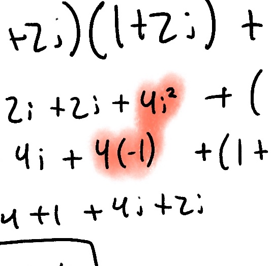{:width="300px"}

Now our sequence looks like this

`Our sequence => 0, 1 + 2i, -2 + 6i`

We can also plot this new point on the complex plane (as well as our starting point of `0`)

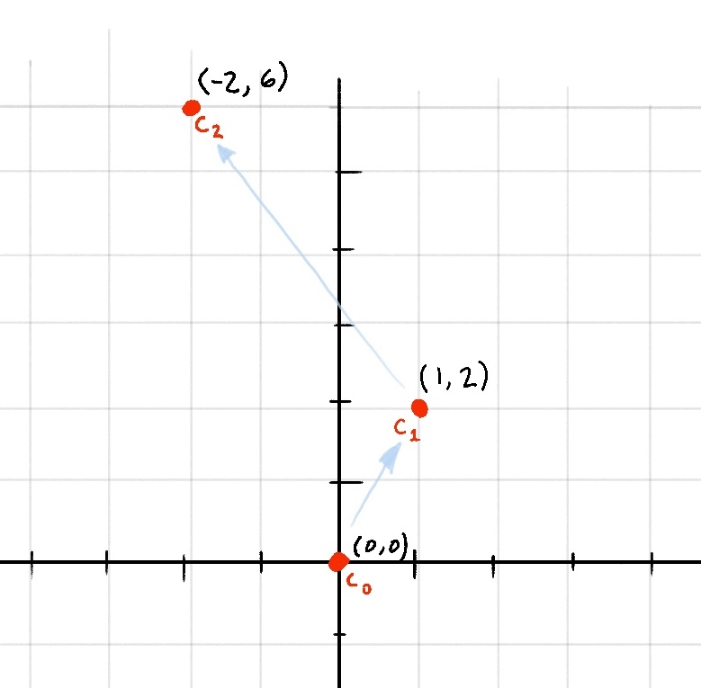{:width="300px"}

Very soon we'll see some emergent behavior from this system, but first lets quickly do one more iteration

(Only look at this next equation if you really care)

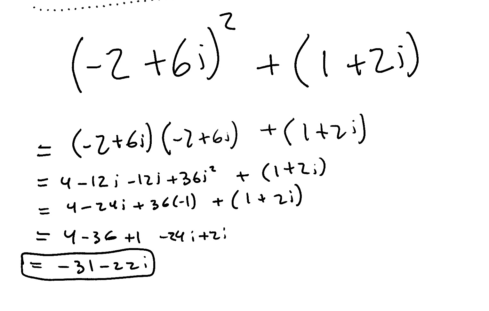{:width="500px"}

`Our sequence => 0, 1 + 2i, -2 + 6i, -31 - 22i`

Now our graph looks like this:

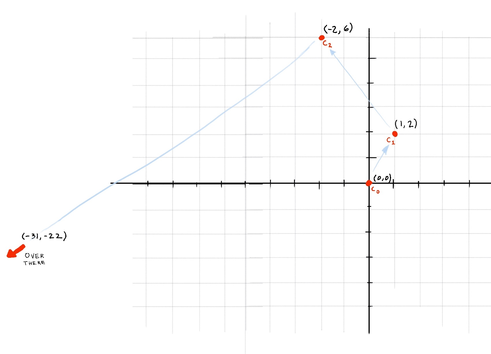{:width="500px"}

Well there goes our point... At this point its obvious that if we continue this sequence it will eventually spiral out to infinity. So we can classify this point as... Drumroll please..... Not in the Mandelbrot set!!!!


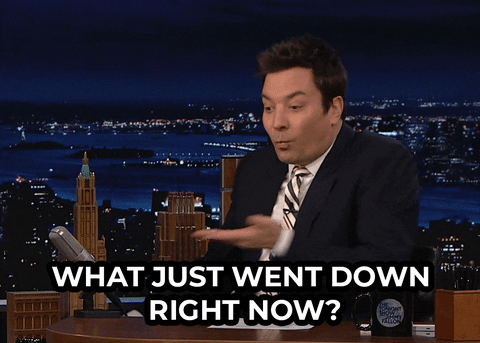{:width="300px"}


Ok, lets back up. First, we chose and arbitrary point on the complex plane: `(1,2)`. Then we **recursively called the Mandelbrot Equation on it**. On every iteration we graphed the points new position and saw that as we ran the function for more and more iterations, the point was quickly escaping the graph and heading out towards infinity.


So back to what I was saying about this point not being in the Mandelbrot set. *(This next part is an important key concept so listen up)*

**Any point on the complex plane will either blow up to infinity or fall into some sort of stable orbit**

To see what I mean, lets try a different point. This time I'll leave out all of the equations behind the scenes and just show you the end graph.

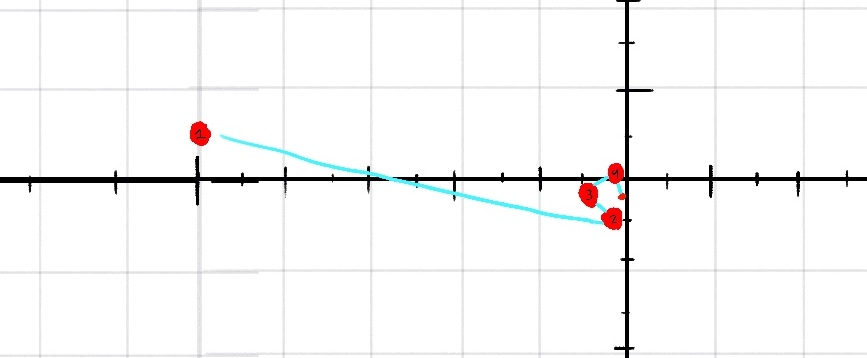{:width="500px"}

You can see that instead of escaping out into infinity, this point seems to do the opposite, and sort of falls in towards the center and floats around. This type of point, one that does not explode out into infinity, *is* in the Mandelbrot set.


# The code
At long last, its time to take all of our newly gained knowledge and make something out of it. We're going to be using **Shader Toy**, which is kind of like replit for high performance graphics shaders. Shader Toy lets us write **GLSL** shaders that run on the GPU. 

**GLSL** is the language of WebGL, which is a technology that allows developers to write high performance graphics on the web.

Go to `shadertoy.com` and sign up for an account. You can complete this Jam without an account if you want, but if you want to share your finished product or save your shader, you need to sign up for a free account.

Once you are logged in, click the `New` button in the top right.

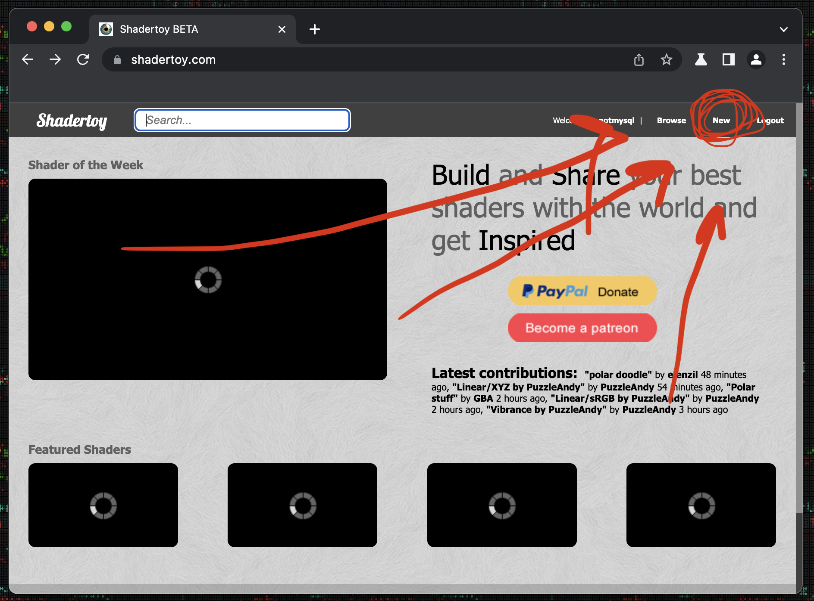{:width="400px"}

After you click that, you'll land on a page that looks like this

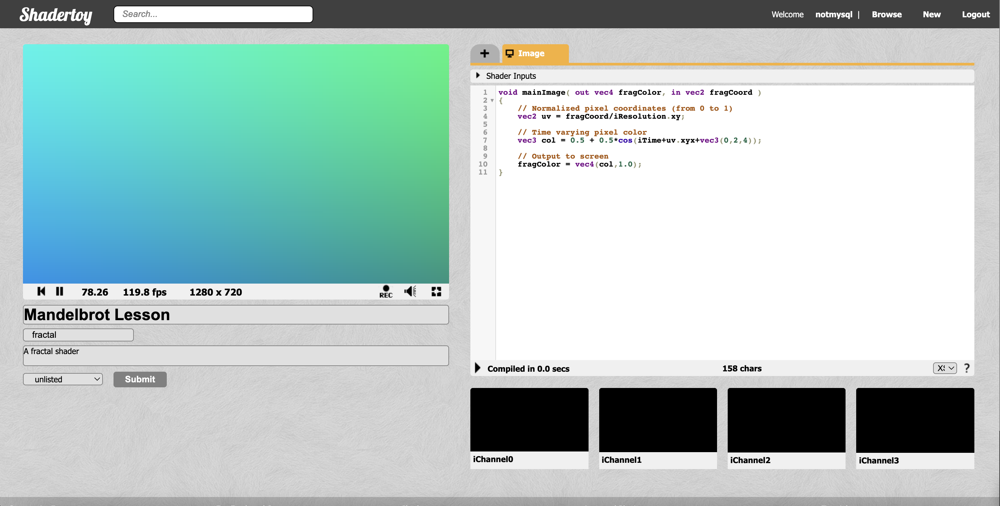{:width="500px"}

I've gone ahead and filled out the Title and Description for this Jam.

We can see that we have a default starter shader already loaded. We're going to start from scratch so begin by replacing all the code in the code box with the following basic script. **Make sure to recompile by clicking the play button at the bottom left of the code box.**

```c
void mainImage( out vec4 fragColor, in vec2 fragCoord )
{
    // Normalized pixel coordinates (from 0 to 1)
    vec2 uv = fragCoord/iResolution.xy;

    // Output to screen
    fragColor = vec4(0.0, 0.0, 0.0, 1.0);
}
```

Here we can see our main function. **This function will be run for every pixel in our image.** Lets walk through the lines.

```c
void mainImage( out vec4 fragColor, in vec2 fragCoord )
```

This defines the main function. `mainImage()` is the convention in ShaderToy. We can see that we are outputting a single `vec4` variable named ***fragColor***, and have access to one `vec2` variable named ***fragCoord***.

***fragCoord*** is the basic input to the shader and is different for every pixel. It is basically just a `vec2` containing the x and y position of the current pixel.


Okay, before we continue, I haven't explained what vectors are, so lets do that quickly;

---

###### What are vectors
Throughout this Jam, and whenever programming in GLSL, you'll see countless examples of Vectors being used. `vec` is a datatype that is used very prominently in GLSL. They each contain either 2, 3, or 4 entries.

```C
// Vectors example

// 2D Vector
vec2 position = vec2(2.0, 3.0)

position.x // => 2.0
position.y // => 3.0

// OR

position[0] // => 2.0
position[1] // => 3.0


// 3D Vector
vec3 position_3D = vec3(2.0, 5.3, 1.0)

position_3D.x // => 2.0
position_3D.y // => 5.3
position_3D.z // => 1.0
```

Okay, now back to the shader code

---

```c
// Normalized pixel coordinates (from 0 to 1)
vec2 uv = fragCoord/iResolution.xy;
```

This line just normalizes our coordinates. If we just use the input to the function, `fragCoord`, the values would be from `1 - width/height of screen`, which would be different for every computer and browser running our program. To solve this, we can use ShaderToy's built in variable `iResolution` to get the screens resolution, and divide `fragCoord` by it. Now we have a new variable, `uv`, which is the current pixels position on the screen, normalized so that all the values fall between 0 and 1.

Heres a simple diagram to show what uv coordinates are

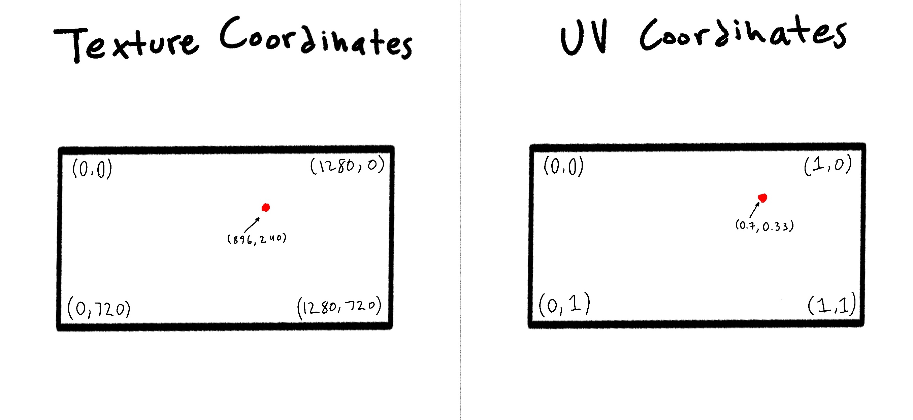{:width="700px"}

***By default we are given the texture coordinate for the pixel, so in this line we just calculate the corresponding UV coordinate.***


On to the next line! (Arguably the most important one)

```C
// Output to screen
fragColor = vec4(0.0, 0.0, 0.0, 1.0);
```

This is the equivalent of "`return`" ing a value in most other programming languages. `fragColor` is an special variable in the GLSL language. It stands for the color of the current pixel. It is a `vec4` variable that holds the `RGBA` color.

	`fragColor = vec4(RED, GREEN, BLUE, ALPHA);

Alpha is just a fancy word for opacity, so lets keep it at 100% for now

You may be used to writing color out on a range from 0 to 255. But like we did for the UV coordinates, GLSL expects these values to be normalized, so a value of 1 is 100% and 0 is 0%.

When our shader exits execution, the value of `fragColor` will be applied to the current pixel.

Try modifying your shader to look like this.

```C
void mainImage( out vec4 fragColor, in vec2 fragCoord )
{
    // Normalized pixel coordinates (from 0 to 1)
    vec2 uv = fragCoord/iResolution.xy;

	// Output based on if current pixels x position is greater than 0.5
    if(uv.x > 0.5){
        fragColor = vec4(1.0,0.0,0.0,1.0);
    } else {
	    fragColor = vec4(0.0, 0.0, 0.0, 1.0);
    }
}
```


{:width="300px"}

Remember that the normalized UV coordinates mean that the halfway line is at x position 0.5, so by coloring pixels who's x UV position is greater than 0.5 red, we get this simple pattern. Try changing 0.5 in the code and seeing what happens.

Another thing you can try is just setting the red value of the `fragColor` to the pixels UV x coordinate

```C
void mainImage( out vec4 fragColor, in vec2 fragCoord )
{
    // Normalized pixel coordinates (from 0 to 1)
    vec2 uv = fragCoord/iResolution.xy;
    
    // Output to screen
    fragColor = vec4(uv.x, 0.0, 0.0, 1.0);
}
```

{:width="300px"}

Then you could even set the blue value equal to the pixel UV y coordinate

```C
fragColor = vec4(0.0, 0.0, uv.y, 1.0);
```

{:width="300px"}

Then combine them into one statement that sets the Red value to the X position and the blue value to the Y position

```C
fragColor = vec4(uv.x, 0.0, uv.y, 1.0);
```

{:width="300px"}

## Coding the Mandelbrot set
Hopefully you're still with me, and hopefully you've either miraculously understood everything up until this point, or you are frantically searching on youtube for a better explanation of the Mandelbrot set(in which case I recommend [this one](https://www.youtube.com/watch?v=GiAj9WW1OfQ), [this one](https://www.youtube.com/watch?v=FFftmWSzgmk), and [The Mandelbrot Set: Atheists’ WORST Nightmare](https://www.youtube.com/watch?v=OlD2rcm971U))(Watch that last one at your own risk)

We are dealing with some pretty high level and abstract mathematical concepts here, so if you want to have a solid foundation going into the end of this Jam, make sure you understand the math.

With that said, lets start coding our final product!

Back in ShaderToy, replace the `fragColor` line and rename the `uv` variable to `c`, because thats the name for the current point in the Mandelbrot equation.

```C
void mainImage( out vec4 fragColor, in vec2 fragCoord )
{
    // Normalized pixel coordinates (from 0 to 1)
    vec2 c = fragCoord/iResolution.xy;
    
    // Output to screen
    fragColor = vec4(0.0, 0.0, 0.0, 1.0);
}
```

Lets define some constants. First, we need a limit for how many times we want to iterate before deciding if the point explodes out to infinity or stays in a stable orbit. The higher the number, the more accurate the image will be, but the slower our program will be.

```C
// Maximum number of iterations
int maxIterations = 256;
```

Lets also add our initial Mandelbrot starting point of (0,0)

```C
vec2 Z = vec2(0,0)
```

We can say our variable `c` is a complex number with its x component being the real part and y component being the imaginary part, so lets write out a quick helper function to handle the "complex" arithmetic

```C
// Squares a given complex number
vec2 cSquare( in vec2 z ) 
{
    return vec2(
            z.x * z.x - z.y * z.y,
            2.0 * z.x * z.y
        );
}

void mainImage( out vec4 fragColor, in vec2 fragCoord )
{
    // Normalized pixel coordinates (from 0 to 1)
    vec2 c = fragCoord/iResolution.xy;
    
    // Maximum number of iterations
    int maxIterations = 256;

	// Starting point
	vec2 Z = vec2(0,0);
    
    // Output to screen
    fragColor = vec4(0.0, 0.0, 0.0, 1.0);
}
```

Don't worry too much about this function- Just know that its there because programming languages aren't really designed for complex math. This function just does the math in a way that the computer can understand.

Now it's time to actually implement the Mandelbrot loop. Lets create a for loop in our main function after we define our `maxIterations`.

```C
for(int i = 0; i < maxIterations; i = i + 1)
{
    // Z(n+1) = Z(n)^2 + C
}
```

(Also don't worry about the curly braces being indented to the next line its just a thing in GLSL ;)

Now heres where our two functions from earlier come into play. 

```C
for(int i = 0; i < maxIterations; i++)
{
    // Z(n+1) = Z(n)^2 + C
    vec2 oldZ = Z;
    Z = cSquare(oldZ) + c;
} 
```

Great! Now we just need to check wether or not the point escapes to infinity. In practice, we don't need to check if it actually gets that far, We can just check if it gets farther that **2** units away from the origin. Thats because all of this beautiful behavior happens on a very small scale so anything that makes it that far is almost definitely heading to infinity.

Add this if statement to the bottom of the for loop

```C
// If the point escapes, color it differently
if(dot(Z, Z) > 4.0) {
    fragColor = vec4(1.0, 0.0, 0.0, 1.0);
} else {
    fragColor = vec4(0.0, 0.0, 0.0, 1.0);
}
```

the `dot()` function is just a way of measuring how far away from the origin the point is.

Re compile and... Nothing! Thats because if we look at the bottom of our code...

```C
		//...
        {
            fragColor = vec4(0.0, 0.0, 0.0, 1.0);
        }
    }
    
    // Output to screen
    fragColor = vec4(0.0, 0.0, 0.0, 1.0);
}
```

We change the value of `fragColor` back to pure black on the last line of the main function. Just delete these lines-

```C
// Output to screen
fragColor = vec4(0.0, 0.0, 0.0, 1.0);
```

And then we get this image:

{:width="300px"}

...

{:width="300px"}

Well hey, at least we're making progress! If we compare our image with another render of the set-

{:width="300px"}

We can see several issues

* Framing: We are only seeing a small part of the set
* Stretching: Our image is horizontally compressed
* Color: Ours is ugly

First up, lets fix the stretching. Remember when I talked about converting texture to UV coordinates, here lets look at the picture again real quick

{:width="400px"}

Well the problem is that in our original texture coordinates, the Y axis(height) is 720 pixels, which is 560 pixels shorter than the X axis(width). This is a size difference of 43.75%, while in the UV Coordinates, both the X and Y axis are forced to be the same length, which effectively stretches the Y axis and shrinks the X axis. Not good for our Mandelbrot image.

To fix this, we can just change which axis we choose to use to convert to UV space. Currently, we use both independently

```C
// Normalized pixel coordinates (from 0 to 1)
vec2 c = fragCoord/iResolution.xy;
```

Instead we can just choose one axis to use to stretch both axis equally. In this case we just use the x axis because of very important reasons(I choose randomly ;)

(In the code just delete the Y at the end of the line)

```C
// Normalized pixel coordinates (from 0 to 1)
vec2 c = fragCoord/iResolution.x;
```

{:width="300px"}

More progress!

Now for the framing. This is kind of two problems in one, the scale(zoom), and the translation. First, like deal with the scale. We can deal with this by literally changing the plane on which the points are located

```C
// Normalized pixel coordinates (from 0 to 1)
vec2 c = fragCoord/iResolution.x;
    
// Scale [lower is more zoomed in]
float scale = 4.0;
    
c *= scale;
```

{:width="300px"}

And this makes sense when you think about it. Now, our plane is **4 times bigger**, so all points are now **4 time farther apart**. The smaller this number is(or more accurately, the closer it approaches to zero) the farther we will zoom into the set.

Now for translation. This is pretty simple, we can just directly apply transformations to the point.

```C
// Normalized pixel coordinates (from 0 to 1)
vec2 c = fragCoord/iResolution.x;
    
// Scale [lower is more zoomed in]
float scale = 4.0;
    
c *= scale;

// Move set into view
c += vec2(-2.7,-1.1);
```

{:width="300px"}

I came up with these transformation with trail and error by the way, which is the way that you do a LOT of stuff in GLSL. Unlike more languages, GLSL has zero output other than the end shader result. There is no way to debug a variable, or even `console.log()` or `print()`

Now for the fun part.. COLORS!!

There are a few ways we can color this set, and we have lots of information about a pixel to use when coloring it, but a really popular way to do it is to follow this flow
1. Is the point in the Mandelbrot set? 
	1. Yes: Color that point **BLACK**
	2. No: Color that point **Based on *how many iterations it took before the point escaped to infinity***

Luckily we are already doing the calculation in a for loop, so we have access to the variable `i`, which tells us how many iterations have passed. When we hit the if statement and we have escaped, we can use that variable `i` to see how many iterations have passed. Lets try making a greyscale image with `i` being the brightness if the point escapes. 

One thing to remember is that we need to normalize the variable first, so we can just divide it by `maxIterations`

```C
if(dot(Z, Z) > 4.0) {
	// Normalize i for brightness
	float brightness = float(i) / float(maxIterations)
	
    fragColor = vec4(1.0, 0.0, 0.0, 1.0);
    break;
```

The cool thing is that `vectors` have a pretty amazing constructor so if we run `vec3(1.0)` the constructor will fill in the other two value with the single one provided

```C
a = vec3(1.0) // => vec3(1.0, 1.0, 1.0)
b = vec4(2.4) // => vec4(2.4, 2.4, 2.4, 2.4)

vec4(a, 5.0) // => vec4(1.0, 1.0, 1.0, 5.0)
```

So lets use that to generate the brightness of the pixel

```C
if(dot(Z, Z) > 4.0) {
    // Normalize i for brightness
    float brightness = float(i) / float(maxIterations);
            
    fragColor = vec4(vec3(brightness), 1.0);
    break;
```

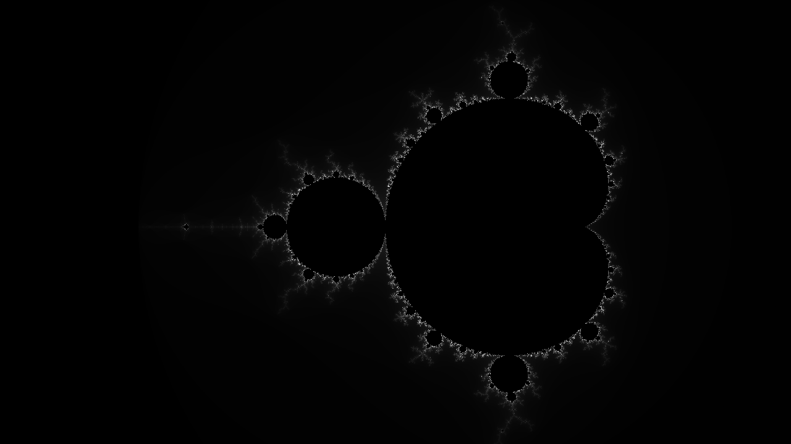{:width="700px"}


## old stuff ignore

Fractals come in many varieties, some very interesting and some very boring. Lets look at the simplest fractals for example.

Lets imagine creating a tree. We start by placing one trunk in the ground.

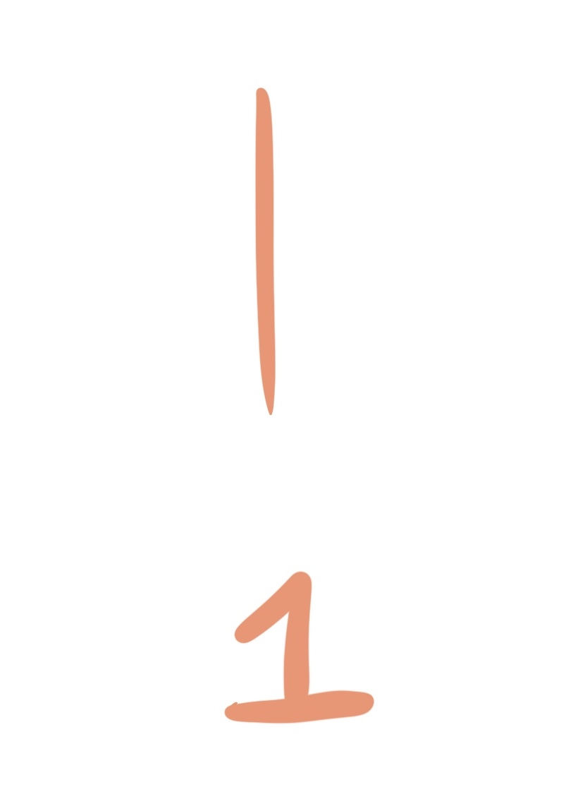{:width="200px"}

Now lets imagine that this tree splits into two branches

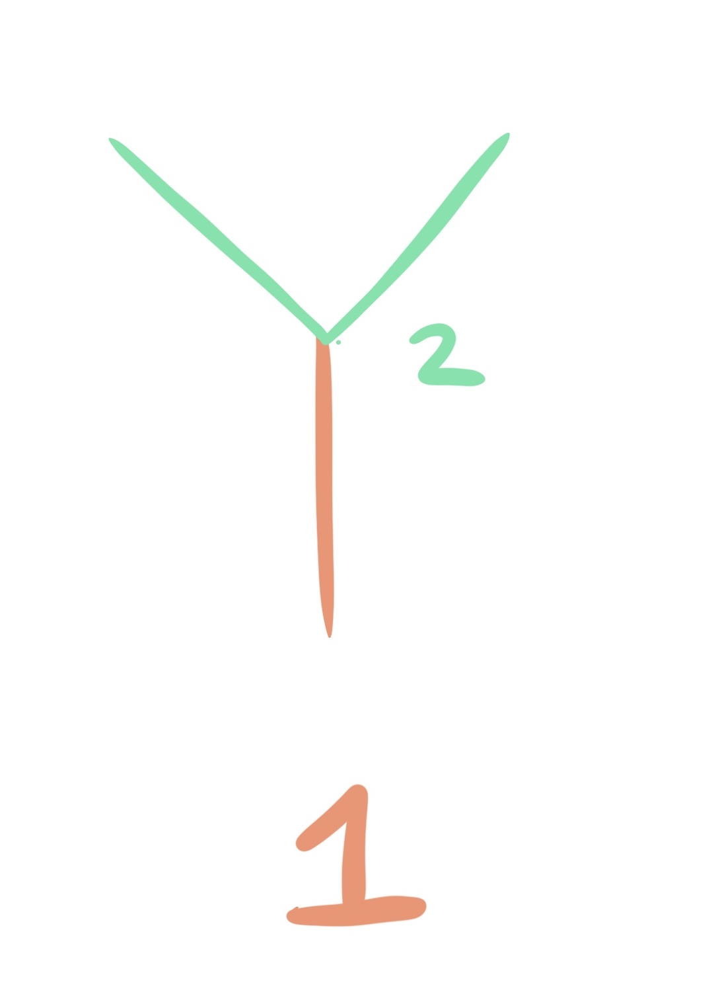{:width="200px"}

And then splitting each of these branches into two additional branches, and so on and so on, splitting each new branch into two identical branches

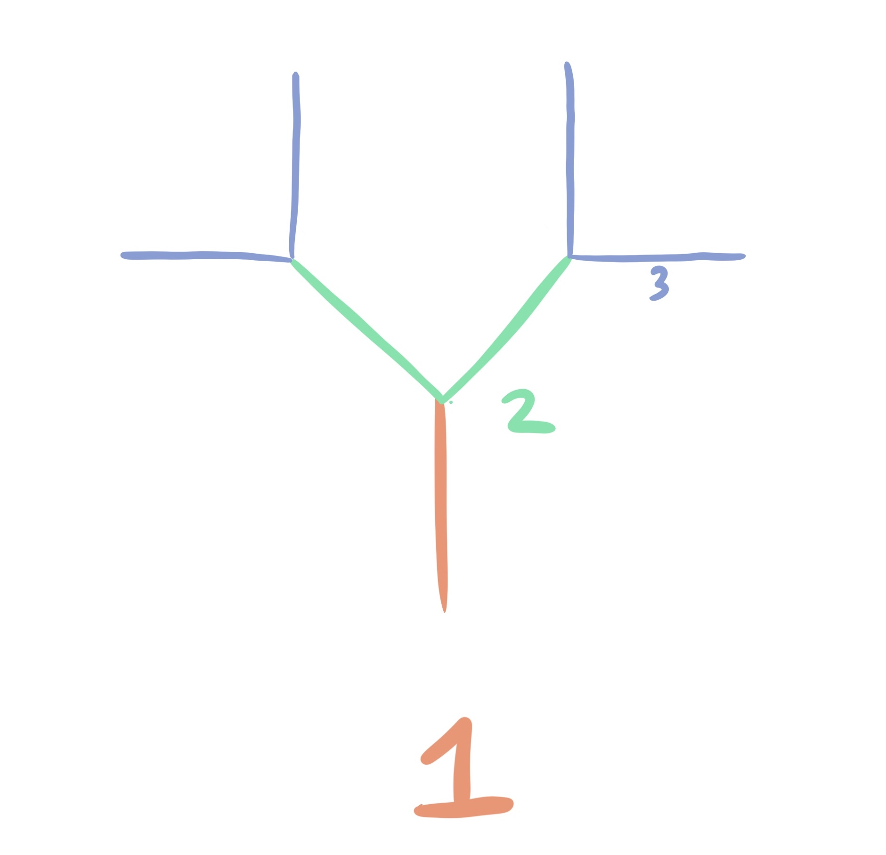{:width="300px"}

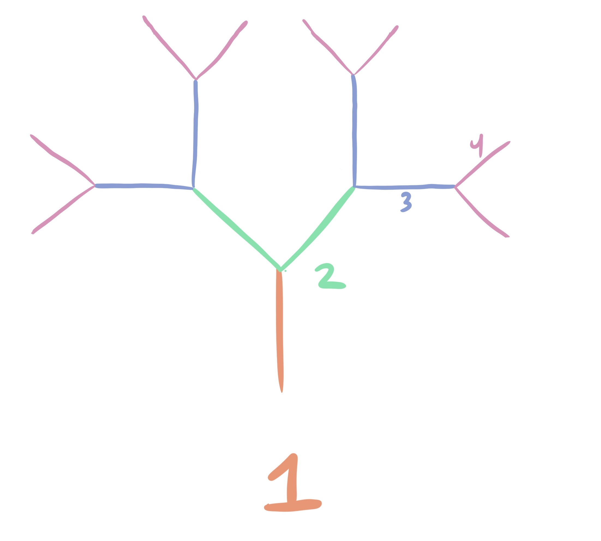{:width="300px"}

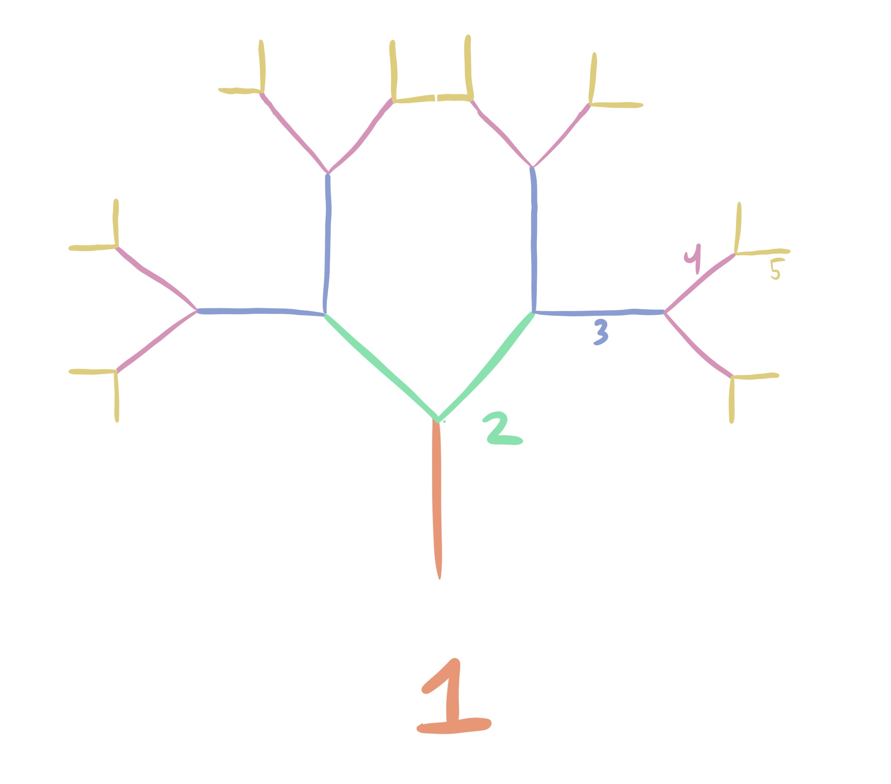{:width="400px"}

And you can imagine this process continuing onto infinity, leaving a tree with infinitely many branches.

At this point we can notice something very interesting. If you focus on only the first green branch, you can see that if you rotate it by 45 degrees, you are left with our original drawing. This property is called ***Self Similarity***, which is a common trait for fractals.


The Mandelbrot set is also self similar, but what even is the Mandelbrot set?

